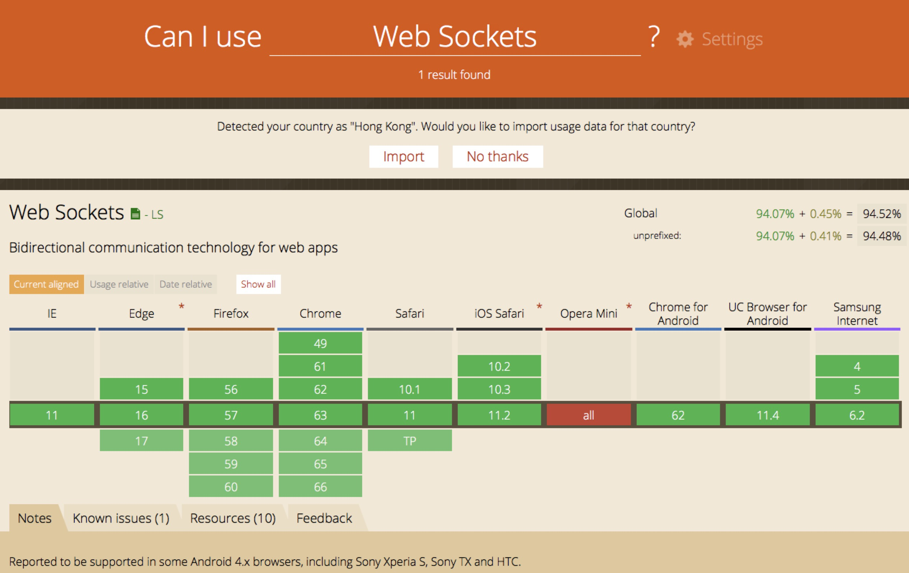

# web即时通信最佳实践
在网络越来越发达的今天，我们的生活越来越离不开网络应用的存在，比如微信，QQ、京东，淘宝、网络游戏，H5网页游戏等。所有这些网络应用可以分为客户端和服务器端两个部分，浏览器可以看作一个特殊的客户端。客户端和服务器端之间通过网络通信进行数据传输。而网络通信基本上可以分为Http短连接和Socket长连接两种。不同的平台对于这两种方式有类似的实现方式，本文将介绍基于web的实时通信的可能实现方案以及不同需求的最优方案。

### 传统Web的通信原理
传统的基于浏览器的通信方式主要是基于Http的超文本传输协议。Http是一个基于请求/响应模式的、无状态的协议。即我们通常所说的Request/Response。这种模式需要通过刷新浏览器获得服务器端端数据，后来发展出来的Ajax(XMLHttpRequest是核心)技术，可以不用刷新浏览器更新数据。
- **问题** 这种模式的主要问题是，只能客户端主动请求，如果服务器端有数据更新后，无法主动推送给客户端。比如基于web的聊天，H5网络游戏、基于web的实时消息通知等，这些需求是传统web通信方式无法实现的，因此需要一项新的技术：web实时通信技术。

### web及时通信的几种实现方案
#### Ajax JSONP Polling（短轮询）
实现思路：客户端通过Ajax（jsonp实现跨域）的方式每隔一小段时间发送一个请求到服务器，服务器立刻返回数据。
- 优点：短连接，服务器处理简单，支持跨域。
- 缺点：有一定延迟、服务器压力较大，浪费带宽流量。

### Ajax Long Polling(长轮询)
实现思路：客户端通过Ajax（jsonp实现跨域）发起请求，服务器不马上返回，而是保持这个连接，直到有数据要push给客户端时（或time out)才发送response给客户端。客户端收到response之后马上再发起一个新的request给服务器，周而复始。
- 优点：减少轮询次数，低延迟，浏览器兼容性较好
- 缺点：服务器需要保持大量连接
- 应用场景：对实时性要求较高和浏览器覆盖面广的应用，如微博私信等一些简单即时聊天

### AJAX multipart streaming（Comet）
实现思路：浏览器必须支持multi-part标志，通过XMLHttpRequest发出request，服务器保持住这个连接，然后可以通过HTTP1.1的chunked encoding机制不断push数据给浏览器直到timeout数据给浏览器直到timeout或者手动断开连接。
优点：客户端一次连接，服务器数据可多次推送。
缺点：并非所有的浏览器都支持 multi-part 标志。
客户端代码示例：

```
var xhr = $.ajaxSettings.xhr(); 
xhr.multipart = true; 
xhr.open('GET', 'ajax', true); 
xhr.onreadystatechange = function() { 
    if (xhr.readyState == 4) { 
        processEvents($.parseJSON(xhr.responseText)); 
    } 
}; 
xhr.send(null);
```
服务端代码示例：
```
protected void doGet(HttpServletRequest req, HttpServletResponse resp) 
        throws ServletException, IOException { 
    // 开始请求的挂起
    AsyncContext asyncContext = req.startAsync(); 
    asyncContext.setTimeout(0); 
 
    // 给客户端发回多部分的分隔符
    resp.setContentType("multipart/x-mixed-replace;boundary=\""
        + boundary + "\""); 
    resp.setHeader("Connection", "keep-alive"); 
    resp.getOutputStream().print("--" + boundary); 
    resp.flushBuffer(); 
 
    // 把异步上下文放在列表中以备将来之用
    asyncContexts.offer(asyncContext); 
}
```

### Forever Iframe（Comet）
实现思路：在浏览器中动态载入一个隐藏的iframe标签，该标签的src属性指向请求的服务器url(实际上向服务器发送了一个http请求),然后浏览器端创建一个处理数据的函数，在服务器通过iframe与浏览器的长连接定时输出数据给客户端，但是返回的数据时一个类似script标签的文本，浏览器解析为js代码并执行其中的函数，从而达到通信的目的（和jsonp类似）
- 优点：实现简单，在所有支持 iframe 的浏览器上都可用、客户端一次连接、服务器多次推送
- 缺点：无法准确知道连接状态，IE浏览器在iframe请求期间，浏览器title一直处于加载状态，底部状态栏也显示正在加载，用户体验不好（htmlfile可以解决此问题）


### Flash Socket
实现思路：在页面中内嵌入一个使用了Socket类的Flash程序，JavaScript通过调用此Flash程序提供的Socket接口与服务器端的Socket接口进行通信，JavaScript通过Flash Socket接收到服务器端传送的数据
- 优点：实现真正的即时通信，而不是伪即时
- 缺点：客户端必须安装Flash插件；非HTTP协议，无法自动穿越防火墙

### websocket
实现思路：WebSocket是HTML5开始提供的一种浏览器与服务器间进行全双工通讯的网络技术。依靠这种技术可以实现客户端和服务器端的长连接，双向实时通信。
- 优点：长连接，双向、低延迟和易于处理错误。实现真正的即时通信
- 缺点：部分浏览器不支持。
浏览器支持情况：

示例代码：https://github.com/theturtle32/WebSocket-Node
客户端代码：

```
window.onload=function(){
        var ws=new WebSocket("ws://127.0.0.1:8088");
        var oText=document.getElementById('message');
        var oSend=document.getElementById('send');
        var oClose=document.getElementById('close');
        var oUl=document.getElementsByTagName('ul')[0];
        ws.onopen=function(){
            oSend.onclick=function(){
                if(!/^\s*$/.test(oText.value)){
                    ws.send(oText.value);
                }
            };
 
        };
        ws.onmessage=function(msg){
          var str="<li>"+msg.data+"</li>";
          oUl.innerHTML+=str;
        };
        ws.onclose=function(e){
            console.log("已断开与服务器的连接");
            ws.close();
        }
    }
```

服务器代码：
```
//握手成功之后就可以发送数据了
var crypto = require('crypto');
var WS = '258EAFA5-E914-47DA-95CA-C5AB0DC85B11';
var server=require('net').createServer(function (socket) {
    var key;
    socket.on('data', function (msg) {
        if (!key) {
            //获取发送过来的Sec-WebSocket-key首部
            key = msg.toString().match(/Sec-WebSocket-Key: (.+)/)[1];
            key = crypto.createHash('sha1').update(key + WS).digest('base64');
            socket.write('HTTP/1.1 101 Switching Protocols\r\n');
            socket.write('Upgrade: WebSocket\r\n');
            socket.write('Connection: Upgrade\r\n');
            //将确认后的key发送回去
            socket.write('Sec-WebSocket-Accept: ' + key + '\r\n');
            //输出空行，结束Http头
            socket.write('\r\n');
        } else {
            var msg=decodeData(msg);
            console.log(msg);
            //如果客户端发送的操作码为8,表示断开连接,关闭TCP连接并退出应用程序
            if(msg.Opcode==8){
                socket.end();
                server.unref();
            }else{
                socket.write(encodeData({FIN:1,
                    Opcode:1,
                    PayloadData:"接受到的数据为"+msg.PayloadData}));
            }
 
        }
    });
});
    server.listen(8000,'localhost');
//按照websocket数据帧格式提取数据
function decodeData(e){
    var i=0,j,s,frame={
        //解析前两个字节的基本数据
        FIN:e[i]>>7,Opcode:e[i++]&15,Mask:e[i]>>7,
        PayloadLength:e[i++]&0x7F
    };
    //处理特殊长度126和127
    if(frame.PayloadLength==126)
        frame.length=(e[i++]<<8)+e[i++];
    if(frame.PayloadLength==127)
        i+=4, //长度一般用四字节的整型，前四个字节通常为长整形留空的
            frame.length=(e[i++]<<24)+(e[i++]<<16)+(e[i++]<<8)+e[i++];
    //判断是否使用掩码
    if(frame.Mask){
        //获取掩码实体
        frame.MaskingKey=[e[i++],e[i++],e[i++],e[i++]];
        //对数据和掩码做异或运算
        for(j=0,s=[];j<frame.PayloadLength;j++)
            s.push(e[i+j]^frame.MaskingKey[j%4]);
    }else s=e.slice(i,frame.PayloadLength); //否则直接使用数据
    //数组转换成缓冲区来使用
    s=new Buffer(s);
    //如果有必要则把缓冲区转换成字符串来使用
    if(frame.Opcode==1)s=s.toString();
    //设置上数据部分
    frame.PayloadData=s;
    //返回数据帧
    return frame;
}
//对发送数据进行编码
function encodeData(e){
    var s=[],o=new Buffer(e.PayloadData),l=o.length;
    //输入第一个字节
    s.push((e.FIN<<7)+e.Opcode);
    //输入第二个字节，判断它的长度并放入相应的后续长度消息
    //永远不使用掩码
    if(l<126)s.push(l);
    else if(l<0x10000)s.push(126,(l&0xFF00)>>2,l&0xFF);
    else s.push(
            127, 0,0,0,0, //8字节数据，前4字节一般没用留空
                (l&0xFF000000)>>6,(l&0xFF0000)>>4,(l&0xFF00)>>2,l&0xFF
        );
    //返回头部分和数据部分的合并缓冲区
    return Buffer.concat([new Buffer(s),o]);
}
```

https://zh.scribd.com/document/60898569/WebSockets-The-Real-Time-Web-Delivered


### socket.io
socket.io 是一个为实时应用提供跨平台实时通信的库。socket.io 旨在使实时应用在每个浏览器和移动设备上成为可能，模糊不同的传输机制之间的差异。
socket.io 的名字源于它使用了浏览器支持并采用的 HTML5 WebSocket 标准，因为并不是所有的浏览器都支持 WebSocket ，所以该库支持一系列降级功能：
- Websocket
- Adobe® Flash® Socket
- AJAX long polling
- AJAX multipart streaming
- Forever Iframe
- JSONP Polling

在大部分情境下，你都能通过这些功能选择与浏览器保持类似长连接的功能。

https://github.com/nswbmw/N-chat/wiki/%E7%AC%AC%E4%B8%80%E7%AB%A0-socket.io-%E7%AE%80%E4%BB%8B%E5%8F%8A%E4%BD%BF%E7%94%A8

###  技术选型建议
对于实时性要求高和并发量大的应用，建议方案：
https://github.com/mrniko/netty-socketio
心跳
三次握手


