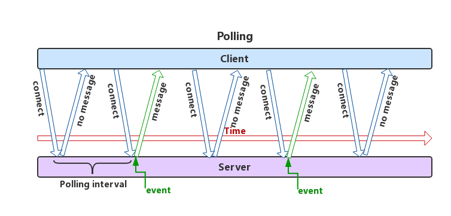
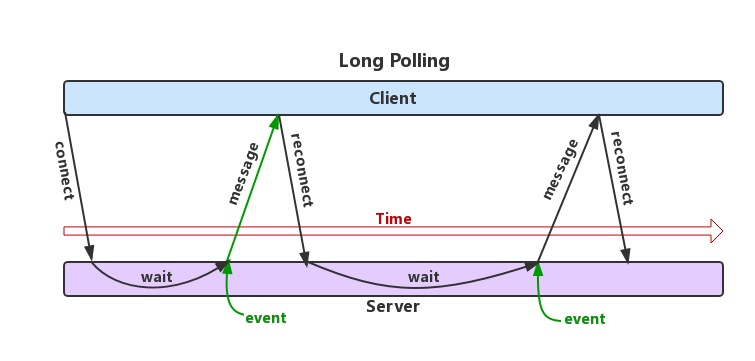

# web即时通信最佳实践

### 概述
传统的浏览器通信方式主要是基于HTTP协议的请求/响应模式。早期必须通过刷新浏览器来更新服务器端的数据，后来出现的Ajax(`XMLHttpRequest`是核心)技术可以不用刷新浏览器更新服务器端数据。但是这种模式的问题在于，只能通过客户端主动请求，服务器应答来获得数据，而服务器端有数据变化后无法通过推送方式主动告诉客户端数据的变化。但是随着网络的发展和需求的变化，越来越多的应用场景需要浏览器支持即时的可服务器端推送的通信方式。在HTML5出现之前，没有一个官方的办法可以做到真正意义上的基于web的通信方案。

### Hacks方式
以下就介绍几种通过hack手段实现的web即时通信方案。
#### Ajax JSONP Polling（短轮询）
**实现思路**：客户端通过Ajax（jsonp实现跨域）的方式每隔一小段时间发送一个请求到服务器，服务器立刻返回数据。


- 优点：短连接，服务器处理简单，支持跨域。
- 缺点：有一定延迟、服务器压力较大，浪费带宽流量。

#### Ajax Long Polling(长轮询)
**实现思路**：客户端通过Ajax（jsonp实现跨域）发起请求（request），服务器不马上返回，而是保持住这个连接，直到有数据要推送给客户端时（或time out)才发送响应（response）给客户端。客户端收到响应之后马上再发起一个新的请求给服务器，周而复始。


- 优点：减少轮询次数，低延迟，浏览器兼容性较好。
- 缺点：服务器需要保持大量连接。
- 应用场景：对实时性要求较高和浏览器覆盖面广的应用，如微博私信等一些简单即时聊天。

#### Forever Iframe（Comet）
**实现思路**：在客户端（浏览器）中动态载入一个隐藏的iframe标签，该标签的src属性指向请求的服务器url(实际上向服务器发送了一个http请求),然后客户端创建一个处理数据的函数，在服务器通过iframe与客户端的长连接定时输出数据给客户端，但是返回的数据是一个类似script标签的文本，客户端解析为js代码并执行其中的函数，从而达到通信的目的（和jsonp类似）

代码示例：
`<script type=\"text/javascript\">parent.process('"+randomNum.toString()+"')</script>`
- 优点：实现简单，在所有支持iframe的浏览器上都可用、客户端一次连接、服务器多次推送。
- 缺点：无法准确知道连接状态，IE浏览器在iframe请求期间，浏览器title一直处于加载状态，底部状态栏也显示正在加载，用户体验不好（`htmlfile`可以解决此问题）。

#### AJAX multipart streaming（Comet）
**实现思路**：浏览器必须支持multi-part标志，客户端通过Ajax发出请求（request），服务器保持住这个连接，然后可以通过`HTTP1.1`的`chunked encoding`机制（即所谓的多部分流）不断push数据给客户端直到timeout数据给客户端直到timeout或者手动断开连接。
优点：客户端一次连接，服务器数据可多次推送。
缺点：并非所有的浏览器都支持`multi-part`标志。

#### Flash Socket
**实现思路**：在页面中内嵌入一个使用了Socket类的Flash程序，JavaScript通过调用此Flash程序提供的Socket接口与服务器端的Socket接口进行通信，JavaScript通过Flash Socket接收到服务器端传送的数据。
- 优点：实现真正的即时通信，而不是伪即时。
- 缺点：客户端必须安装Flash插件；非HTTP协议，无法自动穿越防火墙。

### 解决方案（推荐）
#### Websocket
WebSocket是HTML5开始提供的一种浏览器与服务器间进行全双工通讯的网络技术。依靠这种技术可以实现客户端和服务器端的长连接，双向实时通信。
- 优点：较少的控制开销、更强的实时性、长连接，双向通信、更好的二进制支持。与 HTTP 协议有着良好的兼容性。默认端口也是80和443，并且握手阶段采用 HTTP 协议，因此握手时不容易屏蔽，能通过各种 HTTP 代理服务器。
- 缺点：部分浏览器不支持（支持的浏览器会越来越多）。

浏览器支持情况：


##### 握手
**基于HTTP的握手请求（Opening & Closing Handshake）**
Http、WebSocket等协议属于应用层协议，IP协议工作在网络层，TCP协议工作在传输层。HTTP、WebSocket等应用层协议，都是基于TCP协议来传输数据的。对于WebSocket来说，它必须依赖Http协议进行一次握手，握手成功后，数据就直接从TCP通道传输，与Http无关了（*WebSocket连接只需一次成功握手即可建立*）。


**1、发送握手请求**
客户端到服务器的握手请求：
```
GET /chat HTTP/1.1
Host: server.example.com
Upgrade: websocket
Connection: Upgrade
Sec-WebSocket-Key: dGhlIHNhbXBsZSBub25jZQ==
Origin: http://example.com
Sec-WebSocket-Protocol: chat, superchat
Sec-WebSocket-Version: 13
```
字段：
Origin：用来防止跨域攻击
Sec-WebSocket-Key：是服务器端需要使用客户端发送的这个Key进行校验，然后返回一个校验过的字符串给客户端，客户端验证通过后才能正式建立Socket连接

**2返回握手应答**
服务器返回正确的相应头后，客户端验证后将建立连接，此时状态为OPEN。
服务器响应头如下：
```
HTTP/1.1 101 Switching Protocols
Upgrade: websocket
Connection: Upgrade
Sec-WebSocket-Accept: s3pPLMBiTxaQ9kYGzzhZRbK+xOo=
Sec-WebSocket-Protocol: chat
```

字段：
Sec-WebSocket-Accept：服务器端将加密处理后的握手Key通过这个字段返回给客户端表示服务器同意握手建立连接。

##### 客户端代码示例：

```
var ws = new WebSocket("ws://echo.websocket.org");
ws.onopen = function(evt) { 
  console.log("Connection open ..."); 
  ws.send("Hello WebSockets!");
};
ws.onmessage = function(evt) {
  console.log( "Received Message: " + evt.data);
  ws.close();
};
ws.onerror = function(evt) {
    console.log( "websocket error:" + evt.message);
};
ws.onclose = function(evt) {
  console.log("Connection closed.");
};
```

##### 客户端核心API
websocket所有API详见[这里](https://developer.mozilla.org/en-US/docs/Web/API/WebSocket)

###### WebSocket构造函数


###### webSocket.readyState
```
CONNECTING：值为0，表示正在连接。
OPEN：值为1，表示连接成功，可以通信了。
CLOSING：值为2，表示连接正在关闭。
CLOSED：值为3，表示连接已经关闭，或者打开连接失败。
```

###### webSocket.onopen
用于指定连接成功后的回调函数。

###### webSocket.onclose
用于指定连接关闭后的回调函数。

###### webSocket.onmessage
用于指定收到服务器数据后的回调函数。服务器数据可能是文本，也可能是二进制数据（blob对象或Arraybuffer对象）。可以使用binaryType属性，显式指定收到的二进制数据类型。

###### webSocket.send()
用于向服务器发送数据。

###### webSocket.onerror
用于指定报错时的回调函数。

#### socket.io
socket.io 是一个为实时应用提供跨平台实时通信的库。socket.io 旨在使实时应用在每个浏览器和移动设备上成为可能，模糊不同的传输机制之间的差异。
socket.io 的名字源于它使用了浏览器支持并采用的 HTML5 WebSocket 标准，因为并不是所有的浏览器都支持 WebSocket ，所以该库支持一系列降级功能：
- Websocket
- Adobe® Flash® Socket
- AJAX long polling
- AJAX multipart streaming
- Forever Iframe
- JSONP Polling

在大部分情境下，你都能通过这些功能选择与浏览器保持类似长连接的功能。

https://github.com/nswbmw/N-chat/wiki/%E7%AC%AC%E4%B8%80%E7%AB%A0-socket.io-%E7%AE%80%E4%BB%8B%E5%8F%8A%E4%BD%BF%E7%94%A8

##### 服务端的实现
常用的 Node 实现有以下几种。
[µWebSockets](https://github.com/uNetworking/uWebSockets)
[Socket.IO](https://socket.io/)
[WebSocket-Node](https://github.com/theturtle32/WebSocket-Node)
[websocketd](http://websocketd.com/)

###  技术选型建议
对于实时性要求高和并发量大的应用，建议方案：
https://github.com/mrniko/netty-socketio
心跳


